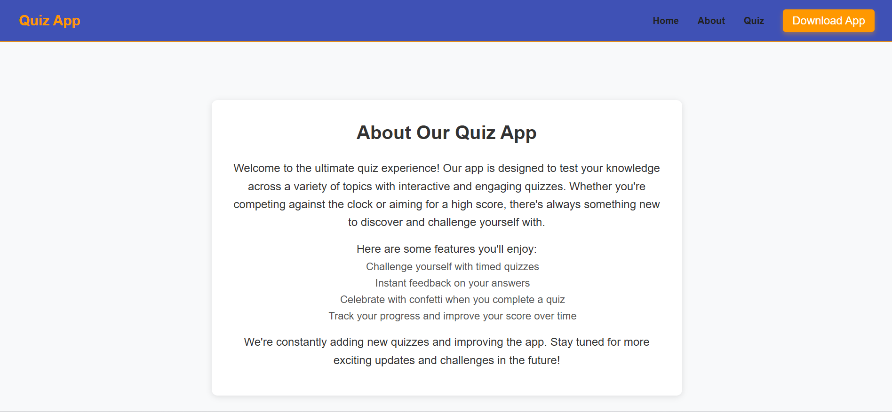

# Quiz App

Welcome to the Quiz App! This fun and interactive quiz application allows you to test your knowledge on various topics. With a countdown timer, instant feedback, and a celebratory confetti effect, you'll have a blast while learning!

## Key Features

- **Timed Quizzes**: Each question has its own countdown timer.
- **Instant Feedback**: You'll know right away if your answer was correct or incorrect.
- **Confetti Celebration**: Celebrate your victory with a confetti explosion when you finish the quiz!
- **Track Your Scores**: Your score is displayed at the end of the quiz, so you can see how you did.

## App Screenshot



## How to Set Up Locally

To run the project on your machine, follow these steps:

1. Clone the repo:

   ```bash
   git clone https://github.com/akashkurdekar7/quiz-assignment.git
   ```

2. Go to the project folder:

   ```bash
   cd quiz-assignment
   ```

3. Install dependencies:

   ```bash
   npm install
   ```

4. Start the development server:
   ```bash
   npm run dev
   ```

Once it's up and running, visit `http://localhost:5173` in your browser.

## Project Structure

Here’s a breakdown of the project structure:

- `src/`: Contains the main code for the app.

  - `components/`: Reusable React components like `Question`, `Quiz`, etc.
  - `assets/`: Static assets, such as images and icons.
  - `App.js`: The entry point of the app.
  - `index.js`: Renders the app to the DOM.

- `public/`: Public files like `index.html`, served directly by the browser.

## API Integration

The quiz questions are pulled from an external API (`https://api.jsonserve.com`). If you wish to use a different API or host your own, simply update the `apiUrl` in the `Question.js` component.

## Technologies Used

This app was built using:

- **React** for building the user interface.
- **Vite** for a fast, modern build setup.
- **styled-components** for styling with CSS-in-JS.
- **axios** for making API calls.
- **react-confetti** for the fun confetti effect when the quiz is completed.
- **react-icons** for various icons in the UI.

## Contributing

Want to help improve the app? Feel free to contribute! Here's how:

1. Fork the repository.
2. Create a new branch (`git checkout -b feature-name`).
3. Commit your changes (`git commit -am 'Add feature'`).
4. Push to the branch (`git push origin feature-name`).
5. Open a Pull Request.

## Acknowledgments

- **React**: For making UI development a breeze.
- **Vite**: For the fast build and dev experience.
- **react-confetti**: For the celebratory confetti animation.
- **react-icons**: For the UI icons.

Enjoy the quiz and feel free to tweak it as you like!

```

I aimed for a friendly and approachable tone. Let me know if you'd like any adjustments!
```
